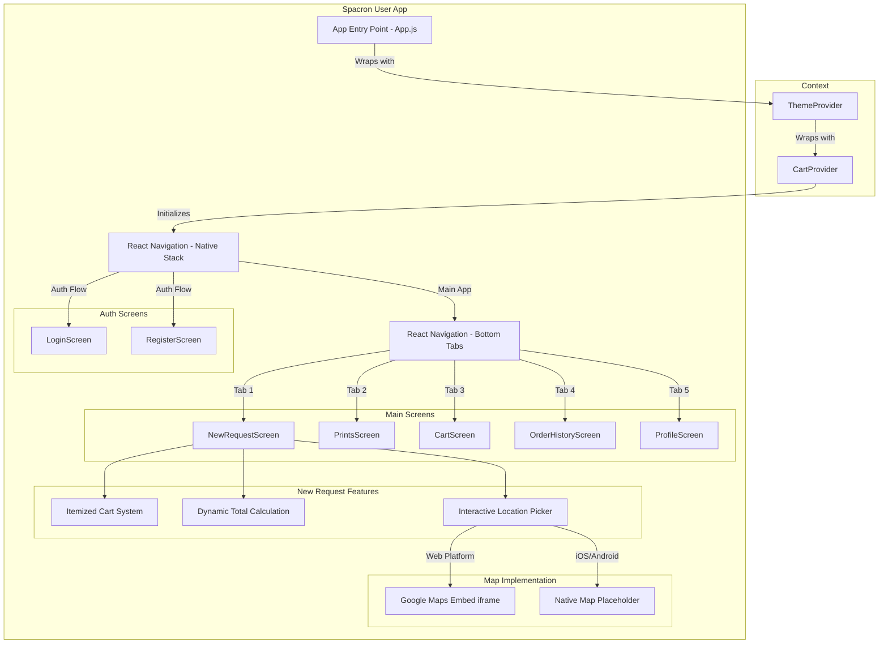

# Spacron User App - Prototype

This is the prototype for the **Spacron User** application, built using React Native and Expo. It allows users to place requests for gigs, add multiple items to a cart, view real-time cost estimations, and specify shop locations using an interactive map interface.

## 🏛 System Architecture



## 🚀 Features

- **Itemized Cart System**: Users can add individual items (e.g., groceries, stationary, medicines) along with their estimated costs.
- **Dynamic Total Calculation**: The app automatically updates the total cost as items are added to or removed from the cart.
- **Interactive Location Picker**: A Google Maps embed allows users to select the exact location of their preferred shop.
- **Cross-Platform Support**: Works seamlessly on Web, Android, and iOS (via Expo).

## 🛠 Prerequisites

Before running the project, make sure you have the following installed:
- [Node.js](https://nodejs.org/en/) (LTS version recommended)
- [npm](https://www.npmjs.com/) (comes with Node.js) or [Yarn](https://yarnpkg.com/)
- [Expo CLI](https://docs.expo.dev/more/expo-cli/) (Included automatically via `npx expo`)

## 📦 Installation

1. **Navigate to the project directory:**
   ```bash
   cd "Spacron User"
   ```
2. **Install Dependencies:**
   ```bash
   npm install
   ```
   *(If you use yarn, run `yarn install` instead)*

## 🏃‍♂️ How to Run the App

To start the Expo development server, run the following command in the root folder:
```bash
npx expo start
```

### 🌐 Run on Web (Recommended for this prototype)
To preview the app directly in your browser with the fully functional interactive Google Maps component:
```bash
npx expo start --web
```
Or if you want to clear the Metro bundler cache simultaneously:
```bash
npx expo start --web --clear
```

### 📱 Run on Android
1. Install the **Expo Go** app on your Android device from the Google Play Store.
2. Run the following command:
   ```bash
   npx expo start --android
   ```
3. Scan the QR code that appears in your terminal using the built-in scanner in the Expo Go app.

### 🍏 Run on iOS
1. Install the **Expo Go** app on your iOS device from the App Store.
2. Run the following command:
   ```bash
   npx expo start --ios
   ```
3. Scan the QR code that appears in your terminal using your iPhone's Camera app.

## 📂 Key Files

- `screens/NewRequestScreen.js`: The main prototype screen handling the new request flow, cart item management, and map integration.
- `package.json`: Contains project metadata, dependencies, and execution scripts.

## 📝 Notes

- The Google Maps integration uses an `iframe` when running on the web, providing an interactive map experience out of the box without requiring native API keys. On native devices (iOS/Android), it will show a placeholder UI until native maps are fully configured via `react-native-maps`.
- The **Gig Reward** is currently hardcoded to `₹0` for demonstration purposes.
